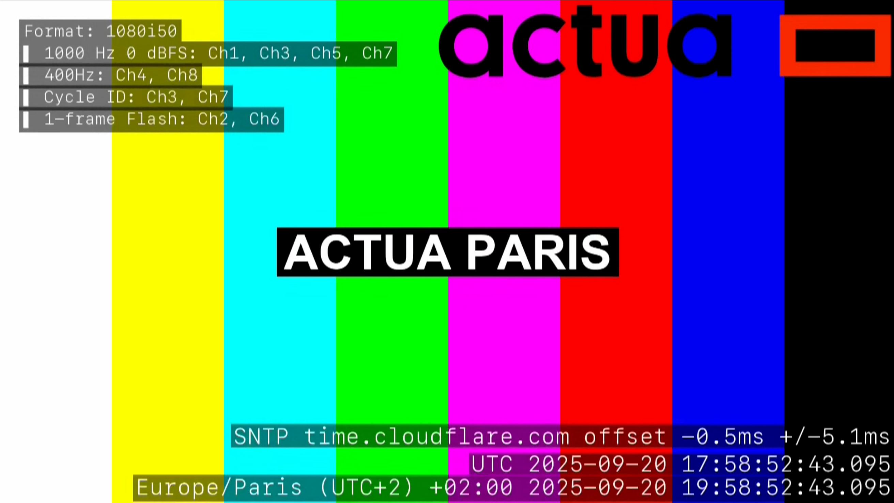
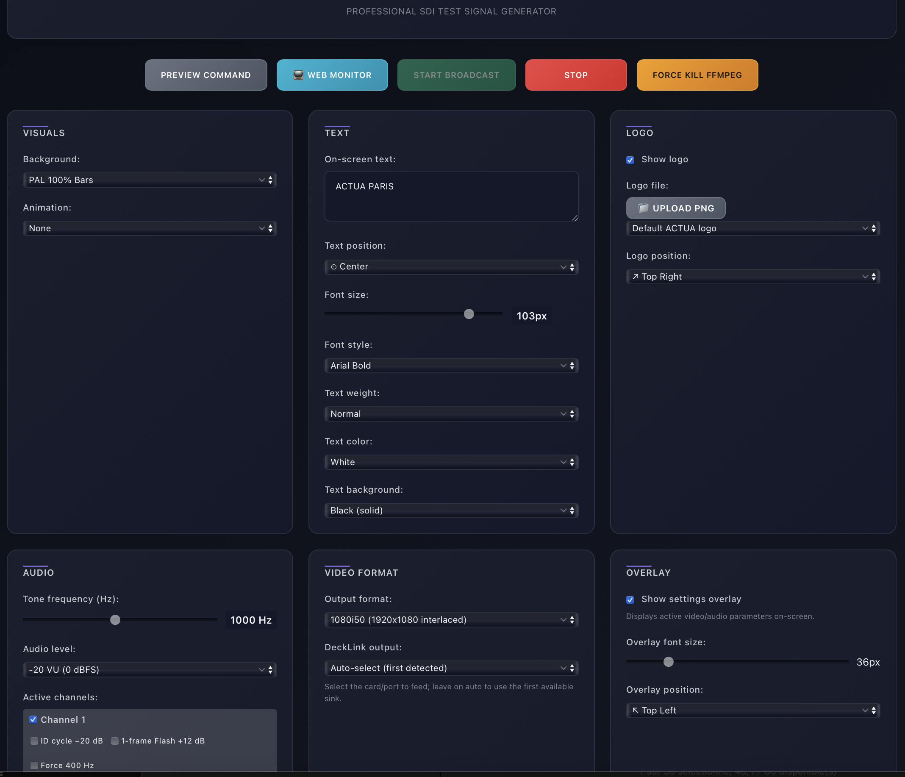
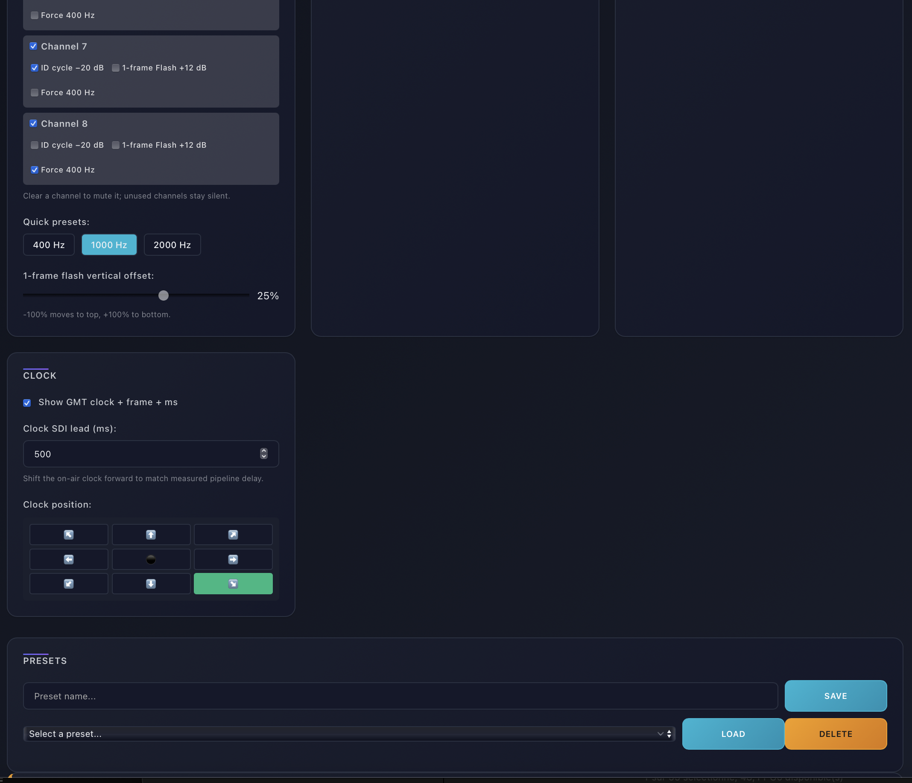

# DeckLink AV Test Pattern Generator

Web interface to send video test patterns and audio tones to a Blackmagic DeckLink SDI output.

Built for macOS. Requires a custom FFmpeg build with DeckLink support — see installation below.

---


*Color bars with logo overlay, NTP-synced clock and settings overlay*


*Main controls: background, text, logo, animations, video format, DeckLink device*


*8-channel audio: per-channel enable, ID cycle, 1-frame flash, 400Hz force*

---

## What it does

- Outputs test patterns to a DeckLink card via SDI
- Video formats: 1080i50, 1080i60, 1080p25/30, 720p50/60, 576i50
- Test sources: SMPTE bars, PAL bars, color bars, gradients, fractals, custom image upload
- 8-channel audio with configurable tone (frequency + level), ID cycling, 1-frame flash
- On-screen text, logo overlay (PNG upload), NTP-synchronized clock
- Preset save/load, real-time FFmpeg log, web monitor (HLS preview)
- Auto-start on server launch via env var

---

## Requirements

- **macOS** (Catalina or later)
- **Blackmagic Desktop Video** drivers — [download here](https://www.blackmagicdesign.com/support/family/capture-and-playback)
- **A DeckLink card** connected (UltraStudio, Mini Monitor, etc.)
- **FFmpeg compiled with `--enable-decklink`** — see below
- **Node.js >= 18**

---

## FFmpeg

The Homebrew FFmpeg does not include DeckLink support. You need to compile it yourself.

**1. Download the Blackmagic DeckLink SDK** (free, same support page as the drivers above).

**2. Compile FFmpeg:**

```bash
./configure \
  --enable-gpl \
  --enable-nonfree \
  --enable-decklink \
  --enable-libfreetype \
  --enable-libfontconfig \
  --extra-cflags="-I/path/to/decklink-sdk/include" \
  --extra-ldflags="-F/Library/Frameworks -framework DeckLinkAPI"
make -j$(sysctl -n hw.ncpu)
```

Compilation takes 15–30 minutes. Put the binary somewhere stable (e.g. `~/ffmpeg-4.4.4/build/bin/ffmpeg`) and set `FFMPEG_PATH` in `.env`.

**Verify DeckLink support:**
```bash
ffmpeg -hide_banner -sinks decklink
# Should list your connected card
```

---

## Install

```bash
git clone https://github.com/stephanebhiri/decklink-AV-test-pattern-generator.git
cd decklink-AV-test-pattern-generator
bash install.sh
```

The script checks Node.js, installs npm dependencies, verifies FFmpeg and drivers, and creates a `.env` template.

---

## Configuration

Edit `web-interface/.env` (created by `install.sh`):

```env
# Path to your FFmpeg binary (required, must have DeckLink support)
FFMPEG_PATH=/path/to/ffmpeg

# Path to your logo PNG (optional, transparent background recommended)
LOGO_PATH=/path/to/logo.png

# Server port (default: 3000)
PORT=3000

# Auto-start broadcast when the server starts
AUTO_START_BROADCAST=false
AUTO_START_DELAY_MS=5000
```

---

## Run

```bash
cd web-interface
node server.js
```

Open [http://localhost:3000](http://localhost:3000).

---

## Notes

- Tested with UltraStudio Mini Monitor and UltraStudio 4K
- NTP sync runs on startup and every 15 minutes (Cloudflare, Google, NIST)
- Uploaded logos and backgrounds persist in `web-interface/uploads/`
- FFmpeg logs stream live in the web UI
- `SIGINT` and `SIGTERM` both cleanly stop the FFmpeg child process

---

## Troubleshooting

**"Unknown input format: decklink"** — FFmpeg was compiled without `--enable-decklink`.

**No DeckLink sinks detected** — Check that Desktop Video is installed, the card is connected, and run `ffmpeg -hide_banner -sinks decklink`.

**Blank output / crash on start** — Check the FFmpeg log in the web UI. Usually a format mismatch with the card.
